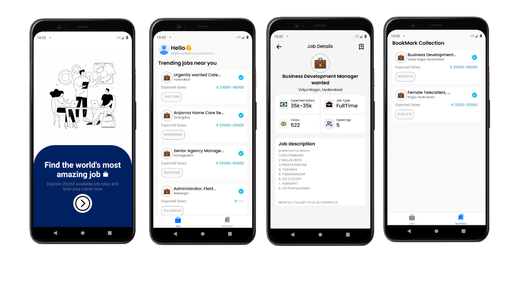

# Job Finder

## Table of Contents

- [Project Description](#project-description)
- [Preview](#preview)
- [Functional Requirements](#functional-requirements)
- [Installation](#installation)
- [Usage](#usage)
- [Project Structure](#project-structure)

## Project Description

Job Finder is a mobile application designed to help users search and bookmark job listings. The app features a simple and intuitive user interface with two main sections: Jobs and Bookmarks. Users can browse job listings fetched from an API, view detailed information about each job, and bookmark jobs for offline viewing.


## Preview
  



## Functional Requirements

- **Bottom Navigation UI**
  - On opening the app, users should be presented with a bottom navigation UI.
  - The navigation should have two sections: "Jobs" and "Bookmarks".

- **Jobs Screen**
  - The Jobs screen should fetch job data from an API using an infinite scroll approach.
  - Each job card should display the following information:
    - Title
    - Location
    - Salary
    - Phone number
  - Clicking on a Job card should show more details related to it on another screen.

- **Job Details Screen**
  - Clicking on a job card should navigate the user to a details screen.
  - The details screen should show more comprehensive information about the job.

- **Bookmarking Jobs**
  - Users should be able to bookmark jobs from the job cards or details screen.
  - Bookmarked jobs should appear in the "Bookmarks" section.

- **Bookmarks Screen**
  - The Bookmarks screen should list all the jobs that the user has bookmarked.
  - Bookmarked jobs should be stored in a database for offline viewing.

- **State Management**
  - The app should maintain appropriate states throughout, including:
    - Loading: Show a loading indicator when data is being fetched.
    - Error: Display an error message if there is an issue fetching data.
    - Empty: Indicate when there are no jobs available to display.


## Installation

1. Clone the repository:

    ```bash
    git clone https://github.com/SamarthKadam/LokalApp.git
    ```

2. Navigate to the project directory:

    ```bash
    cd LokalApp
    ```

3. Install dependencies:

    ```bash
    npm install
    ```

4. Start the Expo server:

   ```bash
    npx expo start
   ```

## Usage

1. **Run on your device:**

   - Connect your physical device using USB and enable usb debugging. And then start the server

2. **Or Run on your Emulator**
    
    - npx expo should start emulator if you have it installed
  


## Project Structure

```bash
LokalApp/
├── assets/            # Asset files (images, fonts, etc.)
├── components/        # Reusable components
├── navigators/        # Navigation configuration
├── pages/             # Page components
├── services/          # Service functions and API calls
├── App.jsx            # Entry point of the application
├── app.json           # Expo configuration
├── package.json       # Project dependencies and scripts
└── README.md          # Project documentation

```
